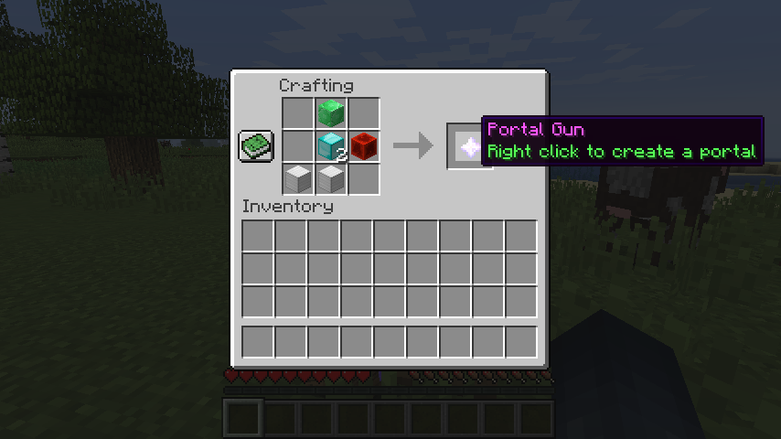

<h3 align="center">
  🌌
<br/><br/>
portal
<br/>
an easy-to-use portal gun for minecraft
</h3>

<p align="center">
  <a href="https://github.com/insanj/portal/releases">
    
  </a>

  <a href="https://github.com/insanj/portal/">
    
  </a>

  <a href="https://github.com/insanj/portal/blob/master/LICENSE">
    
  </a>

  <br/>

  <a href="https://jdk.java.net/">
    
  </a>
  
  <a href="https://getbukkit.org/download/craftbukkit">
    
  </a>
  
  <a href="https://bukkit.org/threads/portal-gun.478108/">
    
  </a>
</p>

<p align="center">
  Now you can use a Portal Gun to travel around various places in your Minecraft world!
<br/>
  Based off of the <a href="https://bukkit.org/threads/portal-gun.478108/">Bukkit reqest forum post</a> made by user <a href="https://bukkit.org/members//shikishima.91268249/">Shikishima</a>.
</p>

<br/>
<h2 align="center">How to Play</h2>

---

### Step One: Obtaining a Portal Gun

The actual Portal Gun item is a Nether Star with the destination coordinates displayed below the name. To make one, either issue the command `/portalgun` as an operator, or craft it with:



### Step Two: Fueling the Portal Gun

For a Portal Gun to work, it will use up 1 Ender Pearl from the inventory of the player who opened up the portal.

### Step Three: Setting the Portal Gun destination

Right click anywhere with the Portal Gun in your hand to open the GUI. The x coordinate goes on the first row, the y coordinate goes on the 2nd row and the z coordinate goes on the 3rd row.

Optionally, you can enter the name of the world on the 4th row, in case your server has more than one world, or you'd like to go to the Nether or The End. Make sure to use the name of the save file (ex: `world_nether`, and not the UUID or display name).

### Step Four: Opening up a portal

Once you have set the destination of your Portal Gun, left click anywhere to open up a portal! The portal will immediately appear as green "Happy Villager" particles. 

Unlike Nether Portals or End Portals, the Portal Gun openings only last for **five seconds**. Hurry up and jump through, before it closes, to instantly be teleported to the destination programmed into your Portal Gun!

### Step Five: 🎉 Have fun

Store as many Portal Guns as you want in your inventory. Each one will stay linked to its destination forever, so you can grab whichever you need for the adventure at end!

<br/>
<h2 align="center">What's included</h2>

---

```
.
├── LICENSE -- License for this repository.
├── makefile -- Makefile which uses simple bash commands to compile and build the JAR without an IDE.
├── README.md -- The file you are currently reading.
├── build -- Build directory generated by the makefile, can be deleted at any time.
│   ├── bin
│   │   ├── me
│   │   │   └── insanj
│   │   │       └── portal
│   │   │           └── *.class
│   │   └── plugin.yml
│   └── portal-version.jar
├── external -- External dependancies directory. You have to download these open source JARs and place them here; or change the PATH in the makefile.
│   ├── craftbukkit-1.13.2.jar
│   └── spigot-1.13.2.jar
├── plugin -- Source code directory, structured as a standard Java package.
│   ├── me
│   │   └── insanj
│   │       └── anvilgui -- Source of GUI, https://github.com/WesJD/AnvilGUI
│   │       └── portal
│   │           ├── Portal.java
│   │           ├── PortalGunClickListener.java
│   │           ├── PortalPlayerMoveListener.java
│   │           ├── PortalCommandExecutor.java
│   │           └── PortalGun.java
│   └── plugin.yml -- Configuration file which also defines current version number (see git tag as well).
└── server -- Optional directory for testing out the plugin on a local server.
```

<br/>
<h2 align="center">Authors</h2>

--- 

```
Julian Weiss
me@insanj.com
github.com/insanj
```

<br/>
<h2 align="center">Acknowledgements</h2>

---

### Related Projects
- [PortalGun](https://github.com/MrDaniel-TX/PortalGun/) (most recent plugin; forked to create this project)
- [MC Portals](https://dev.bukkit.org/projects/mc-portals?gameCategorySlug=bukkit-plugins&projectID=309181)
- [TravelPortals](https://dev.bukkit.org/projects/travelportals/pages/how-to-make-a-portal)
- [Portal Gun](https://dev.bukkit.org/projects/portal-gun)
- [BuildPortals](https://dev.bukkit.org/projects/buildportals?gameCategorySlug=bukkit-plugins&projectID=99352)
- [WorldPortals](https://dev.bukkit.org/projects/world-portals-ng?gameCategorySlug=bukkit-plugins&projectID=283014)

### Helpful Resources
- [AnvilGUI](https://github.com/WesJD/AnvilGUI)
- [Sign GUI](https://bukkit.org/threads/sign-gui-use-the-sign-interface-to-get-user-input.177030/)

<br/>
<h2 align="center">License</h2>

---

See [LICENSE](https://github.com/insanj/portal/blob/master/LICENSE). (c) 2019 Julian Weiss.

#### AnvilGUI

```
MIT License

Copyright (c) 2016 Wesley Smith

Permission is hereby granted, free of charge, to any person obtaining a copy
of this software and associated documentation files (the "Software"), to deal
in the Software without restriction, including without limitation the rights
to use, copy, modify, merge, publish, distribute, sublicense, and/or sell
copies of the Software, and to permit persons to whom the Software is
furnished to do so, subject to the following conditions:

The above copyright notice and this permission notice shall be included in all
copies or substantial portions of the Software.

THE SOFTWARE IS PROVIDED "AS IS", WITHOUT WARRANTY OF ANY KIND, EXPRESS OR
IMPLIED, INCLUDING BUT NOT LIMITED TO THE WARRANTIES OF MERCHANTABILITY,
FITNESS FOR A PARTICULAR PURPOSE AND NONINFRINGEMENT. IN NO EVENT SHALL THE
AUTHORS OR COPYRIGHT HOLDERS BE LIABLE FOR ANY CLAIM, DAMAGES OR OTHER
LIABILITY, WHETHER IN AN ACTION OF CONTRACT, TORT OR OTHERWISE, ARISING FROM,
OUT OF OR IN CONNECTION WITH THE SOFTWARE OR THE USE OR OTHER DEALINGS IN THE
SOFTWARE.
```

